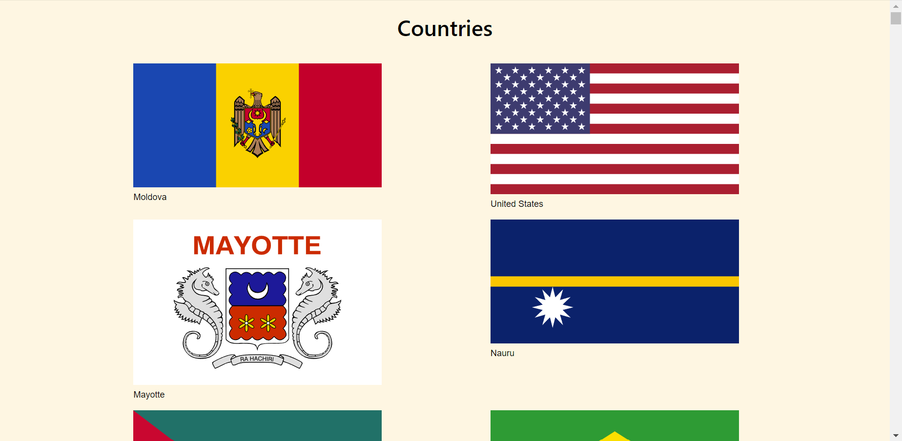
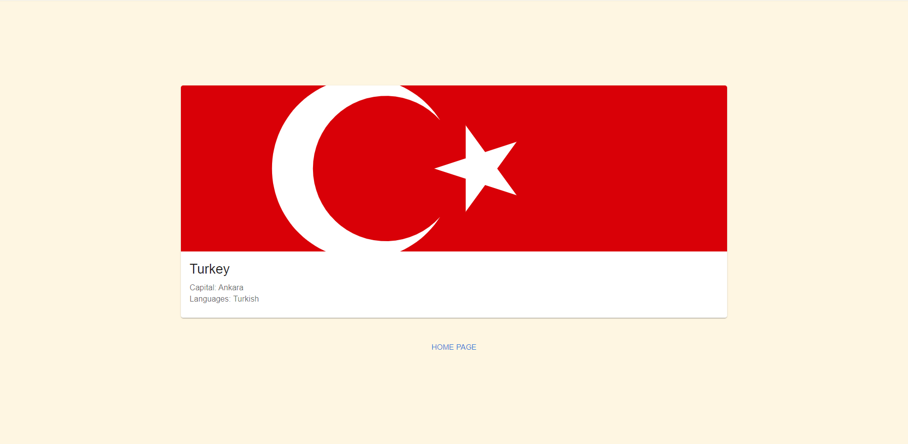

## Link
Backend: https://restcountries.com/

## Usage
Clone repository:

  `git clone git@github.com:IrinaGarmaeva/mesto-react.git`

Install dependencies:

  `npm install`

Run app:

  `npm run start`

## Screenshots

<b>Show all</b>

